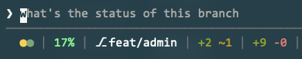

# ccwidgets

CLI widgets for Claude Code and terminal statuslines. Lightweight scripts for displaying Claude usage, git status, and context metrics.

## Preview



```
●●  17%  │  feat/admin  │  +2 ~1  │  +9 -0
│    │        │             │         └─ git-lines (+added -removed)
│    │        │             └─────────── git-files (+new ~modified)
│    │        └───────────────────────── git branch
│    └────────────────────────────────── context-pct (context %)
└─────────────────────────────────────── claude-usage-widget (quota dots)
```

**Claude usage widget states:**

```
●●                    # All good (green dots)
●●                    # Weekly attention (yellow + green)
●● S:35% (1.3x)       # Weekly critical (shows remaining % and pace)
●● 5h:80% 2h          # 5h critical (shows usage and reset time)
```

## Installation

```bash
# Clone the repo (pick your preferred location)
git clone https://github.com/vittodevit/ccwidgets ~/.local/ccwidgets

# Run installer (creates symlinks in ~/.local/bin)
~/.local/ccwidgets/install.sh
```

The installer will:
1. Create symlinks for all scripts in `~/.local/bin`
2. Check for required dependencies (`python3`, `jq`, `git`)
3. Warn if `~/.local/bin` is not in your PATH

### Manual Installation

If you prefer manual setup:

```bash
# Add to PATH (in ~/.bashrc or ~/.zshrc)
export PATH="$HOME/.local/bin:$PATH"

# Create symlinks manually
ln -sf ~/.local/ccwidgets/scripts/claude-pace/claude-pace ~/.local/bin/
ln -sf ~/.local/ccwidgets/scripts/claude-usage-widget/claude-usage-widget.sh ~/.local/bin/
# ... etc
```

## Scripts

| Script | Purpose | Output |
|--------|---------|--------|
| `claude-pace` | Claude API usage + pace calculation | JSON or pretty |
| `claude-usage-widget.sh` | Compact two-dot indicator | `●●` with colors |
| `context-pct.sh` | Context window percentage | `42%` with colors |
| `git-files.sh` | File status counts | `+3 ~2 -1` |
| `git-lines.sh` | Line diff counts | `+45 -12` |

### ccw wrapper

All scripts are also available via the `ccw` command:

```bash
ccw usage --pretty    # → claude-pace --pretty
ccw widget            # → claude-usage-widget.sh
ccw context           # → context-pct.sh
ccw git-files         # → git-files.sh
ccw git-lines         # → git-lines.sh
```

## Integration Examples

### ccstatusline

[ccstatusline](https://github.com/anthropics/claude-code) is Claude Code's statusline system.

```yaml
# ~/.config/ccstatusline/config.yaml
sections:
  - name: git-files
    command: git-files.sh
  - name: git-lines
    command: git-lines.sh
  - name: usage
    command: claude-usage-widget.sh
  - name: context
    command: context-pct.sh
    stdin: true
```

### tmux

```bash
# ~/.tmux.conf
set -g status-right '#(git-files.sh) #(claude-usage-widget.sh)'
```

### starship

```toml
# ~/.config/starship.toml
[custom.claude]
command = "claude-usage-widget.sh"
when = true

[custom.git_files]
command = "git-files.sh"
when = "git rev-parse --git-dir 2>/dev/null"
```

### Shell prompt (bash/zsh)

```bash
# Simple integration
PS1='$(git-files.sh) $ '

# With git branch
PS1='$(git branch --show-current 2>/dev/null) $(git-files.sh) $ '
```

## Requirements

- **macOS** (claude-pace uses Keychain for OAuth token)
- **Python 3.10+** (for claude-pace)
- **jq** (for context-pct.sh)
- **Git** (for git-files/git-lines)
- **Bash** (all scripts)

## How It Works

### Claude Usage Tracking

`claude-pace` fetches usage from Anthropic's OAuth API and calculates:

- **pace_ratio**: Your current usage rate vs sustainable rate
  - `<= 0.8` = banking quota (under pace)
  - `<= 1.0` = on track to use full quota
  - `> 0.9` = warning threshold
  - `> 1.25` = critical (would exhaust ~1.4 days early)

- **safety_ratio**: Runway hours vs hours until reset
  - `> 1.5` = comfortable margin
  - `< 1.5` = warning (reduced margin)
  - `< 1.0` = critical (will exhaust before reset)

- **runway_hours**: Hours of usage remaining at current burn rate
- **buffer_hours**: Runway minus hours until reset (negative = danger)
- **burn_rate**: 5-hour window consumption speed (%/hour)

Status is determined by combining both pace and safety metrics. Safety ratio takes priority: even with a low pace_ratio, you'll see critical status if you're projected to exhaust quota before reset.

Results are cached for 5 minutes at `~/.cache/claude-pace/usage.json`.

### Color Coding

All scripts use truecolor (24-bit RGB) for consistent appearance:

| Color | Meaning | RGB |
|-------|---------|-----|
| Green | OK/Good | Various greens |
| Yellow | Attention | `255,200,50` |
| Orange | Warning | `255,165,0` |
| Red | Critical | `255,85,85` |
| Gray | Inactive | ANSI 90 |

## Customization

Scripts are simple and hackable. Each script folder has its own README with details on thresholds and output format.

To customize thresholds, edit the script directly - they're all single-file with inline documentation.

## Troubleshooting

**"claude-pace: command not found"**
- Ensure `~/.local/bin` is in your PATH
- Run `source ~/.bashrc` or restart your terminal

**"security: SecKeychainSearchCopyNext"**
- You need to be logged into Claude Code (`claude` CLI)
- The OAuth token is stored in macOS Keychain

**Colors look wrong**
- Ensure your terminal supports truecolor (most modern terminals do)
- Check `$TERM` is set to something like `xterm-256color`

## License

MIT

---

<sub>Vibe coded with [Claude Code](https://claude.ai/download) in a single session.</sub>
